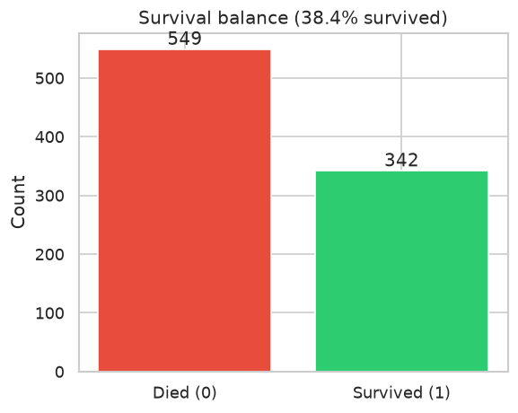
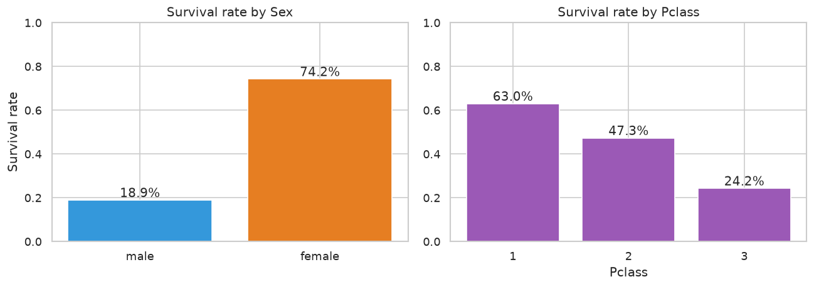
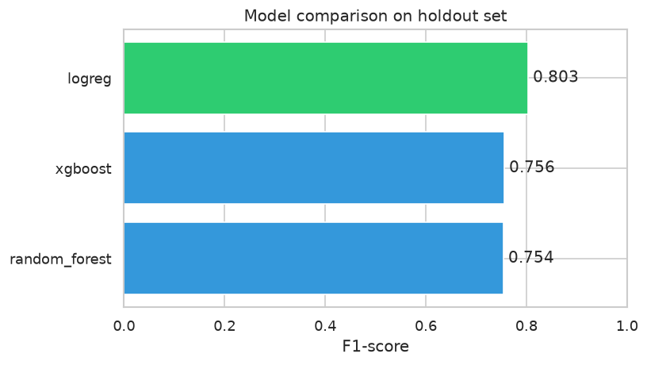
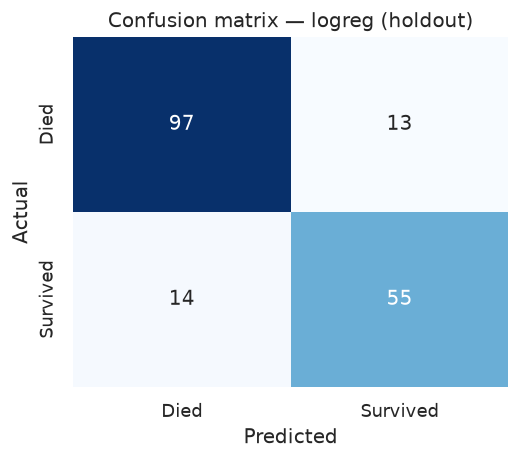
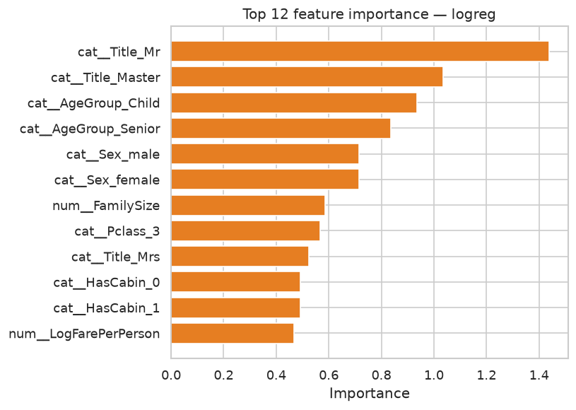

# Titanic — Machine Learning from Disaster

Predict passenger survival on the Titanic. The notebook engineers features from raw passenger data (`Title`, `FamilySize`, `IsAlone`, `HasCabin`, `FarePerPerson`), compares three classifiers, and picks the best one by **F1-score**.

## Results at a glance

| Metric | Value |
|--------|-------|
| Best model | **Logistic Regression** |
| Holdout accuracy | **84.9%** |
| Holdout F1 | **0.803** |
| Runner-up | Random Forest (F1 0.754), XGBoost (F1 0.756) |
| Train / holdout split | 712 / 179 (stratified 80/20) |
| Test predictions | 418 rows |
| Model artifact | `outputs/model.joblib` |

Metrics from the latest run are saved in [`docs/assets/run_summary.json`](docs/assets/run_summary.json).

## Visual results











## Key takeaways

- **Sex** and **Pclass** are by far the strongest survival signals — "women and children first" plus first-class priority during rescue.
- Feature engineering (`Title`, `FamilySize`, `IsAlone`, `HasCabin`, `FarePerPerson`) lets the model exploit hidden structure in the raw columns (`Name`, `Cabin`, `SibSp`/`Parch`, `Fare`) better than using them as-is.
- Across the three models compared, differences are modest — with only ~900 rows, complex ensembles (Random Forest, XGBoost) don't clearly beat a well-regularized Logistic Regression baseline.
- `Age`/`Fare`/`Embarked` imputation statistics are computed **on the train split only** and reused for the holdout and Kaggle test set, avoiding data leakage.

## Quick start

```bash
pip install -r requirements.txt
jupyter notebook titanic_survival.ipynb
```

Run all cells top to bottom. The notebook:
1. Loads `data/train.csv` and `data/test.csv` (already included in this repo).
2. Does EDA on survival by `Sex`/`Pclass`/`Age`, engineers features, trains and compares three models, analyzes the best one, and saves charts + `run_summary.json` + `outputs/model.joblib` + `outputs/submission.csv`.

## Project structure

```
titanic-survival/
├── titanic_survival.ipynb   # main notebook (EDA → feature engineering → models → tuning → artifacts)
├── data/
│   ├── train.csv
│   └── test.csv
├── docs/
│   └── assets/               # README charts + run_summary.json (committed)
├── outputs/                  # model.joblib, submission.csv (gitignored)
└── requirements.txt
```

## Dataset

[Titanic - Machine Learning from Disaster](https://www.kaggle.com/competitions/titanic) — 891 labeled training passengers, 418 unlabeled test passengers. Features include `Pclass`, `Name`, `Sex`, `Age`, `SibSp`, `Parch`, `Ticket`, `Fare`, `Cabin`, `Embarked`; target `Survived`.
